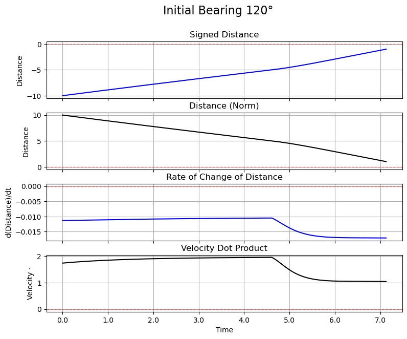

# Pursuit Curves: An Exploration of A Differential Game

We study a variation of the Homicidal Chauffeur Problem in $\mathbb{R}^2$, a differential game involving two agents: an agile prey and a fast predator. We set the strategy of the prey to right-angle acceleration, whereas the predator uses a Proportional Navigation (PN) strategy. We simulate the trajectories using Runge-Kutta 4 integration, leveraging the Python Numba library for computational efficiency. We analyse individual trajectories using summary statistics and Fourier decomposition via the Discrete Cosine Transform. Finally, we explore a large phase space, varying predator speed and prey acceleration and identify regions of behavior corresponding to different capture dynamics. Our results highlight distinct strategy regimes and the expressivity of summary statistics to characterize pursuit-evasion games.

<table>
  <tr>
    <td align="center">
       
      Signed distance plot
    </td>
    <td align="center">
       
      Metrics over the run
    </td>
    <td align="center">
       
      DCT spectrum (log-log scale)
    </td>
  </tr>
</table>

# Evolutionary Algorithm
We were also interested in the setting from the point of view of evolutionary computation. In the second notebook, we used genetic algorithms to find the best predator and the best prey to catch and evade respectively. We considered two versions of the game. In the first version, the predator is fixed, following a pure pursuit algorithm, while the prey has a genome which consists of the react radius, evasion angle, and evasion time. We found that even though the prey genome was explored, this version heavily depended on the initial starting conditions as well as the parameter ranges of the prey genome. In fact, when one of these variables was changed, it would give a too great advantage and a one-sided game would ensue. The second version introduced the concept of energies. The Enhanced Game, as referred to in the notebook assignes to both prey and predator an energy bar which is consumed as they accelerate, and can refill when they are at rest or minimally accelerating. Here, the predator was also given a genome made up of a single variable: pursuit strength. This variable was crucial in controlling how the predator used its energy. In this scenario there was a wider range of behavior and a more elaborate fitness history, with the prey's performance plateauing and the predator taking the upper hand. This experiment showed not only the power of finding optimal strategies with evolutionary algorithms, but also how contingent these results are on the set up of the problem. The most important thing in these algorithms is the framework that the agents interact in, as well as their fitness functions.

# Conclusion

Even when it is reduced to simple and deterministic decision rules for both prey and predator in $\mathbb{R}^2$, the \textit{Homicidal Chauffeur Problem} can exhibits a rich variety of behaviours. In our investigation, we picked right-angle evasion for the prey and Proportional Navigation for the predator; after defining the setting and assumptions, we identified relevant metrics for studying the trajectories: signed and unsigned distances are qualitative indicators of the efficiency of the chase, while the dot product between the velocities highlights alignment in direction between the agents. We compared variations of signed distances through an activation function and applied the cosine transform to study single trajectories, concluding that the most informative log-log plot may be produced through a Hamming window function applied to the positive distance metric. Finally, we picked a region of the parameter space and for fixed initial conditions we varied predator maximum speed and prey acceleration. We identified a two roughly symmetric basins of behaviours, in which predators, if fast enough in relation to the prey's acceleration, chase it in parallel but intercept it at a steep angle of attack, while the opposite phenomenon occurs in the reverse.

